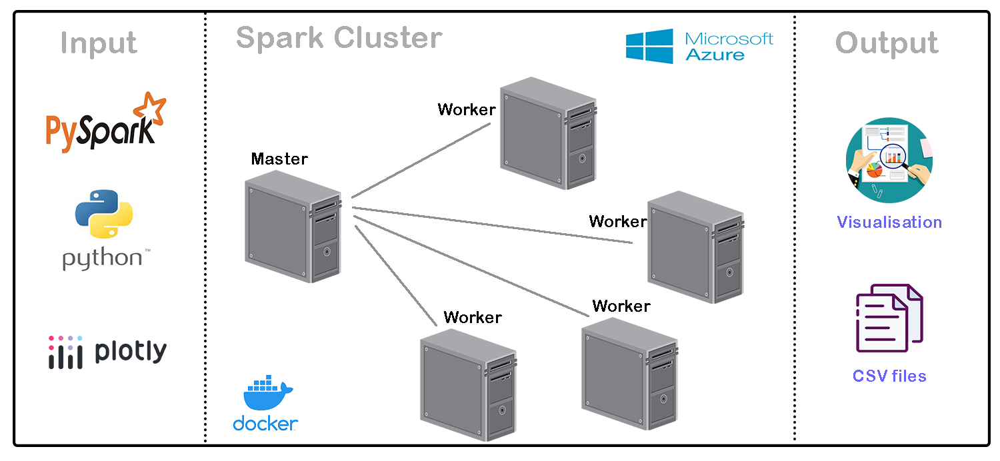
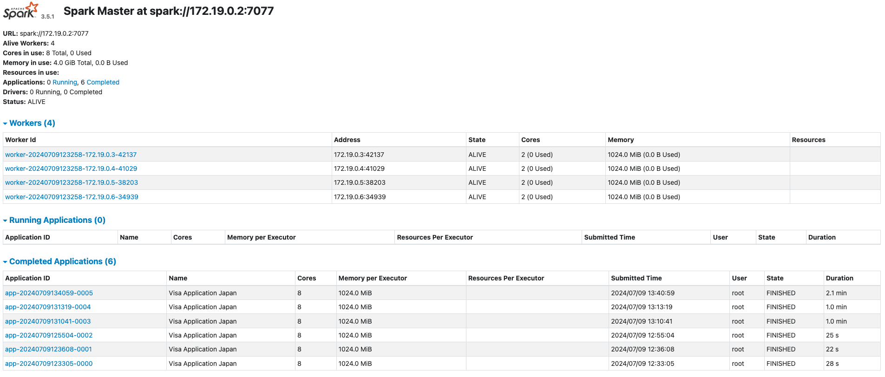
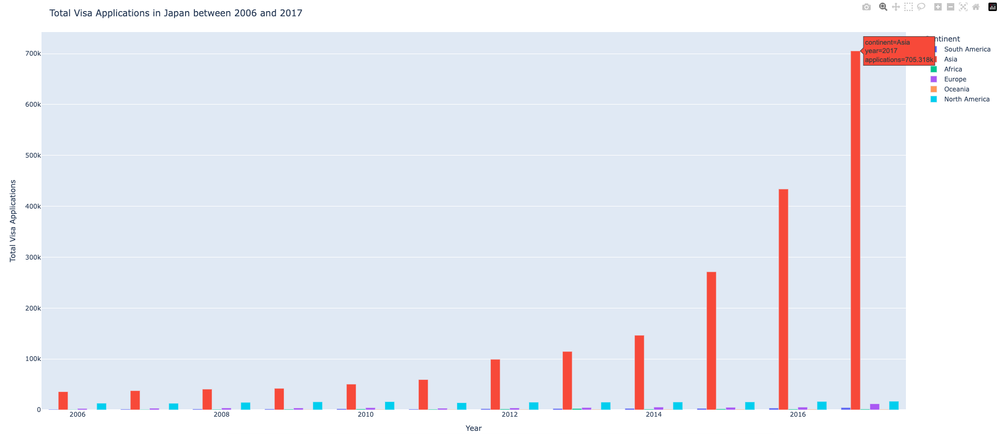
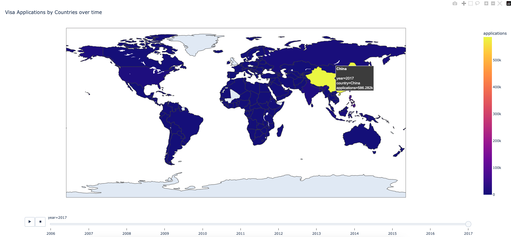
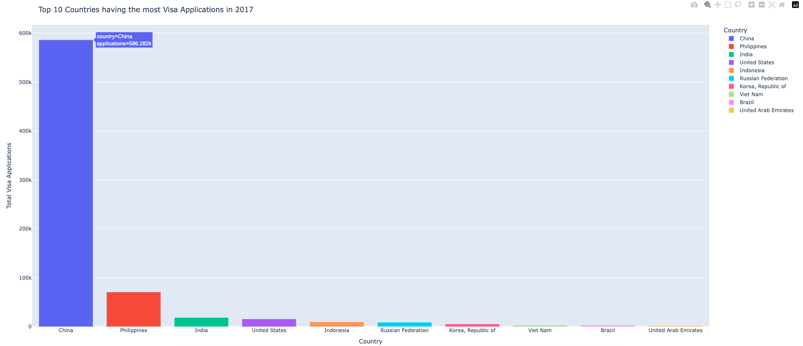

# Japan Visa Applications Analysis

## Overview
This project provides a comprehensive Azure Data Engineering solution for processing and visualising the number of visa applications in Japan, using Azure Cloud Spark Cluster with PySpark and Plotly. Spark clusters are configured within a Docker container on Azure Virtual Machine. The data, sourced from Kaggle.com, includes visa information in Japan from 2006 to 2017.

## Project Goals
- System Architecture: The spark master - worker architecture is configured within a Docker container on Azure Virtual Machine.
- Data Ingestion: The csv file contains visa information in Japan from 2006 to 2017.
- Data Cleaning: Modifying column names, processing missing values, correcting country names.
- Data Transformation: Adding continent name based on the country names.
- Visualisation:
    - What is the trend of visa numbers by continents over time?
    - What is the distribution of visa numbers for each country over time?
    - What is the top 10 countries having the most visa numbers in 2017?

## System Architecture

## Installation
- Azure account: create Virtual Machine service.
- Docker: install Docker Engine on Ubuntu <https://docs.docker.com/engine/install/ubuntu/>

- Python: install required libraries
    - pandas
    - pyspark
    - plotly
    - pycountry-convert
    - fuzzywuzzy
    - python-Levenshtein

## Visualisation

- The number of visa applications increased significantly in Asia from 2006 to 2017. In 2017, the total applications in Asia nearly doubled compared to 2016.
- South America, Africa, Oceania had the lowest visa applications compared to other continents.
- The number of visa applications was slightly stable in North America.
- The total visa applications in Europe was stable from 2006 to 2016 and doubled dramatically in 2017.

- In 2006 and 2007, United States had the most visa applications in Japan. However, from 2008 to 2017, China took the lead, reaching the peak of 586,282k applications in 2017.

- China had the most visa applications in 2017 following by Philipines, India, United States, Indonesia, Russian Federation, Korea - Republic of, Vietnam, Brazil, United Arab Emirates.
